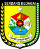

# KODE/LAMBANG KABUPATEN/KOTA DI PROVINSI SUMATERA UTARA

| kode  |nama                          | filename  |logo/lambang                   |
|-------|------------------------------|-----------|:-----------------------------:|
| 12.01 |Kabupaten Tapanuli Tengah     | 12.01.png ||
| 12.02 |Kabupaten Tapanuli Utara      | 12.02.png ||
| 12.03 |Kabupaten Tapanuli Selatan    | 12.03.png ||
| 12.04 |Kabupaten Nias                | 12.04.png ||
| 12.05 |Kabupaten Langkat             | 12.05.png ||
| 12.06 |Kabupaten Karo                | 12.06.png ||
| 12.07 |Kabupaten Deli Serdang        | 12.07.png ||
| 12.08 |Kabupaten Simalungun          | 12.08.png ||
| 12.09 |Kabupaten Asahan              | 12.09.png ||
| 12.10 |Kabupaten Labuhanbatu         | 12.10.png ||
| 12.11 |Kabupaten Dairi               | 12.11.png ||
| 12.12 |Kabupaten Toba                | 12.12.png ||
| 12.13 |Kabupaten Mandailing Natal    | 12.13.png ||
| 12.14 |Kabupaten Nias Selatan        | 12.14.png ||
| 12.15 |Kabupaten Pakpak Bharat       | 12.15.png ||
| 12.16 |Kabupaten Humbang Hasundutan  | 12.16.png ||
| 12.17 |Kabupaten Samosir             | 12.17.png ||
| 12.18 |Kabupaten Serdang Bedagai     | 12.18.png ||
| 12.19 |Kabupaten Batu Bara           | 12.19.png ||
| 12.20 |Kabupaten Padang Lawas Utara  | 12.20.png ||
| 12.21 |Kabupaten Padang Lawas        | 12.21.png ||
| 12.22 |Kabupaten Labuhanbatu Selatan | 12.22.png ||
| 12.23 |Kabupaten Labuhanbatu Utara   | 12.23.png ||
| 12.24 |Kabupaten Nias Utara          | 12.24.png ||
| 12.25 |Kabupaten Nias Barat          | 12.25.png ||
| 12.71 |Kota Medan                    | 12.71.png ||
| 12.72 |Kota Pematangsiantar          | 12.72.png ||
| 12.73 |Kota Sibolga                  | 12.73.png ||
| 12.74 |Kota Tanjungbalai             | 12.74.png ||
| 12.75 |Kota Binjai                   | 12.75.png ||
| 12.76 |Kota Tebing Tinggi            | 12.76.png ||
| 12.77 |Kota Padangsidimpuan          | 12.77.png ||
| 12.78 |Kota Gunungsitoli             | 12.78.png ||
