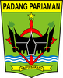
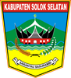
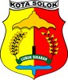
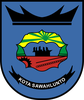

# KODE/LAMBANG KABUPATEN/KOTA DI PROVINSI SUMATERA BARAT

| kode  |nama                          | filename  |logo/lambang                   |
|-------|------------------------------|-----------|:-----------------------------:|
| 13.01 |Kabupaten Pesisir Selatan     | 13.01.png ||
| 13.02 |Kabupaten Solok               | 13.02.png ||
| 13.03 |Kabupaten Sijunjung           | 13.03.png ||
| 13.04 |Kabupaten Tanah Datar         | 13.04.png ||
| 13.05 |Kabupaten Padang Pariaman     | 13.05.png ||
| 13.06 |Kabupaten Agam                | 13.06.png ||
| 13.07 |Kabupaten Lima Puluh Kota     | 13.07.png ||
| 13.08 |Kabupaten Pasaman             | 13.08.png ||
| 13.09 |Kabupaten Kepulauan Mentawai  | 13.09.png ||
| 13.10 |Kabupaten Dharmasraya         | 13.10.png ||
| 13.11 |Kabupaten Solok Selatan       | 13.11.png ||
| 13.12 |Kabupaten Pasaman Barat       | 13.12.png ||
| 13.71 |Kota Padang                   | 13.71.png ||
| 13.72 |Kota Solok                    | 13.72.png ||
| 13.73 |Kota Sawahlunto               | 13.73.png ||
| 13.74 |Kota Padang Panjang           | 13.74.png ||
| 13.75 |Kota Bukittinggi              | 13.75.png ||
| 13.76 |Kota Payakumbuh               | 13.76.png ||
| 13.77 |Kota Pariaman                 | 13.77.png ||
