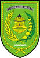
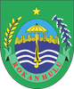
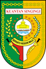

# KODE/LAMBANG KABUPATEN/KOTA DI PROVINSI RIAU

| kode  |nama                          | filename  |logo/lambang                   |
|-------|------------------------------|-----------|:-----------------------------:|
| 14.01 |Kabupaten Kampar              | 14.01.png ||
| 14.02 |Kabupaten Indragiri Hulu      | 14.02.png ||
| 14.03 |Kabupaten Bengkalis           | 14.03.png ||
| 14.04 |Kabupaten Indragiri Hilir     | 14.04.png ||
| 14.05 |Kabupaten Pelalawan           | 14.05.png ||
| 14.06 |Kabupaten Rokan Hulu          | 14.06.png ||
| 14.07 |Kabupaten Rokan Hilir         | 14.07.png ||
| 14.08 |Kabupaten Siak                | 14.08.png ||
| 14.09 |Kabupaten Kuantan Singingi    | 14.09.png ||
| 14.10 |Kabupaten Kepulauan Meranti   | 14.10.png ||
| 14.71 |Kota Pekanbaru                | 14.71.png ||
| 14.72 |Kota Dumai                    | 14.72.png ||
