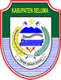
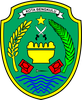

# KODE/LAMBANG KABUPATEN/KOTA DI PROVINSI BENGKULU

| kode  |nama                          | filename  |logo/lambang                   |
|-------|------------------------------|-----------|:-----------------------------:|
| 17.01 |Kabupaten Bengkulu Selatan    | 17.01.png ||
| 17.02 |Kabupaten Rejang Lebong       | 17.02.png ||
| 17.03 |Kabupaten Bengkulu Utara      | 17.03.png ||
| 17.04 |Kabupaten Kaur                | 17.04.png ||
| 17.05 |Kabupaten Seluma              | 17.05.png ||
| 17.06 |Kabupaten Mukomuko            | 17.06.png ||
| 17.07 |Kabupaten Lebong              | 17.07.png ||
| 17.08 |Kabupaten Kepahiang           | 17.08.png ||
| 17.09 |Kabupaten Bengkulu Tengah     | 17.09.png ||
| 17.71 |Kota Bengkulu                 | 17.71.png ||
