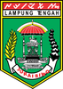
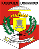
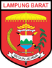
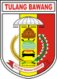
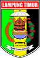
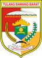
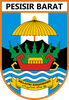

# KODE/LAMBANG KABUPATEN/KOTA DI PROVINSI LAMPUNG

| kode  |nama                          | filename  |logo/lambang                   |
|-------|------------------------------|-----------|:-----------------------------:|
| 18.01 |Kabupaten Lampung Selatan     | 18.01.png ||
| 18.02 |Kabupaten Lampung Tengah      | 18.02.png ||
| 18.03 |Kabupaten Lampung Utara       | 18.03.png ||
| 18.04 |Kabupaten Lampung Barat       | 18.04.png ||
| 18.05 |Kabupaten Tulang Bawang       | 18.05.png ||
| 18.06 |Kabupaten Tanggamus           | 18.06.png ||
| 18.07 |Kabupaten Lampung Timur       | 18.07.png ||
| 18.08 |Kabupaten Way Kanan           | 18.08.png ||
| 18.09 |Kabupaten Pesawaran           | 18.09.png ||
| 18.10 |Kabupaten Pringsewu           | 18.10.png ||
| 18.11 |Kabupaten Mesuji              | 18.11.png ||
| 18.12 |Kabupaten Tulang Bawang Barat | 18.12.png ||
| 18.13 |Kabupaten Pesisir Barat       | 18.13.png ||
| 18.71 |Kota Bandar Lampung           | 18.71.png ||
| 18.72 |Kota Metro                    | 18.72.png ||
