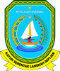
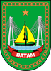
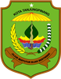

# KODE/LAMBANG KABUPATEN/KOTA DI PROVINSI KEP. RIAU

| kode  |nama                          | filename  |logo/lambang                   |
|-------|------------------------------|-----------|:-----------------------------:|
| 21.01 |Kabupaten Bintan              | 21.01.png ||
| 21.02 |Kabupaten Karimun             | 21.02.png ||
| 21.03 |Kabupaten Natuna              | 21.03.png ||
| 21.04 |Kabupaten Lingga              | 21.04.png ||
| 21.05 |Kabupaten Kepulauan Anambas   | 21.05.png ||
| 21.71 |Kota Batam                    | 21.71.png ||
| 21.72 |Kota Tanjung Pinang           | 21.72.png ||
