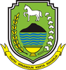
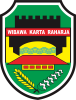
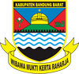
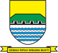
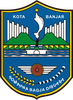

# KODE/LAMBANG KABUPATEN/KOTA DI PROVINSI JAWA BARAT

| kode  |nama                          | filename  |logo/lambang                   |
|-------|------------------------------|-----------|:-----------------------------:|
| 32.01 |Kabupaten Bogor               | 32.01.png ||
| 32.02 |Kabupaten Sukabumi            | 32.02.png ||
| 32.03 |Kabupaten Cianjur             | 32.03.png ||
| 32.04 |Kabupaten Bandung             | 32.04.png ||
| 32.05 |Kabupaten Garut               | 32.05.png ||
| 32.06 |Kabupaten Tasikmalaya         | 32.06.png ||
| 32.07 |Kabupaten Ciamis              | 32.07.png ||
| 32.08 |Kabupaten Kuningan            | 32.08.png ||
| 32.09 |Kabupaten Cirebon             | 32.09.png ||
| 32.10 |Kabupaten Majalengka          | 32.10.png ||
| 32.11 |Kabupaten Sumedang            | 32.11.png ||
| 32.12 |Kabupaten Indramayu           | 32.12.png ||
| 32.13 |Kabupaten Subang              | 32.13.png ||
| 32.14 |Kabupaten Purwakarta          | 32.14.png ||
| 32.15 |Kabupaten Karawang            | 32.15.png ||
| 32.16 |Kabupaten Bekasi              | 32.16.png ||
| 32.17 |Kabupaten Bandung Barat       | 32.17.png ||
| 32.18 |Kabupaten Pangandaran         | 32.18.png ||
| 32.71 |Kota Bogor                    | 32.71.png ||
| 32.72 |Kota Sukabumi                 | 32.72.png ||
| 32.73 |Kota Bandung                  | 32.73.png ||
| 32.74 |Kota Cirebon                  | 32.74.png ||
| 32.75 |Kota Bekasi                   | 32.75.png ||
| 32.76 |Kota Depok                    | 32.76.png ||
| 32.77 |Kota Cimahi                   | 32.77.png ||
| 32.78 |Kota Tasikmalaya              | 32.78.png ||
| 32.79 |Kota Banjar                   | 32.79.png ||
