# KODE/LAMBANG KABUPATEN/KOTA DI PROVINSI JAWA TENGAH

| kode  |nama                          | filename  |logo/lambang                   |
|-------|------------------------------|-----------|:-----------------------------:|
| 33.01 |Kabupaten Cilacap             | 33.01.png ||
| 33.02 |Kabupaten Banyumas            | 33.02.png |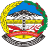|
| 33.03 |Kabupaten Purbalingga         | 33.03.png ||
| 33.04 |Kabupaten Banjarnegara        | 33.04.png |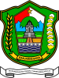|
| 33.05 |Kabupaten Kebumen             | 33.05.png ||
| 33.06 |Kabupaten Purworejo           | 33.06.png ||
| 33.07 |Kabupaten Wonosobo            | 33.07.png ||
| 33.08 |Kabupaten Magelang            | 33.08.png ||
| 33.09 |Kabupaten Boyolali            | 33.09.png ||
| 33.10 |Kabupaten Klaten              | 33.10.png |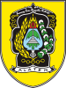|
| 33.11 |Kabupaten Sukoharjo           | 33.11.png |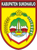|
| 33.12 |Kabupaten Wonogiri            | 33.12.png |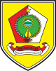|
| 33.13 |Kabupaten Karanganyar         | 33.13.png ||
| 33.14 |Kabupaten Sragen              | 33.14.png |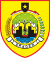|
| 33.15 |Kabupaten Grobogan            | 33.15.png |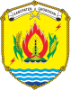|
| 33.16 |Kabupaten Blora               | 33.16.png |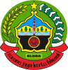|
| 33.17 |Kabupaten Rembang             | 33.17.png |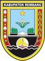|
| 33.18 |Kabupaten Pati                | 33.18.png |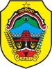|
| 33.19 |Kabupaten Kudus               | 33.19.png |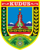|
| 33.20 |Kabupaten Jepara              | 33.20.png ||
| 33.21 |Kabupaten Demak               | 33.21.png ||
| 33.22 |Kabupaten Semarang            | 33.22.png ||
| 33.23 |Kabupaten Temanggung          | 33.23.png ||
| 33.24 |Kabupaten Kendal              | 33.24.png ||
| 33.25 |Kabupaten Batang              | 33.25.png |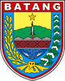|
| 33.26 |Kabupaten Pekalongan          | 33.26.png ||
| 33.27 |Kabupaten Pemalang            | 33.27.png |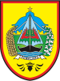|
| 33.28 |Kabupaten Tegal               | 33.28.png ||
| 33.29 |Kabupaten Brebes              | 33.29.png ||
| 33.71 |Kota Magelang                 | 33.71.png ||
| 33.72 |Kota Surakarta                | 33.72.png ||
| 33.73 |Kota Salatiga                 | 33.73.png ||
| 33.74 |Kota Semarang                 | 33.74.png ||
| 33.75 |Kota Pekalongan               | 33.75.png ||
| 33.76 |Kota Tegal                    | 33.76.png ||
