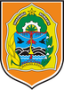

# KODE/LAMBANG KABUPATEN/KOTA DI PROVINSI DI YOGYAKARTA

| kode  |nama                          | filename  |logo/lambang                   |
|-------|------------------------------|-----------|:-----------------------------:|
| 34.01 |Kabupaten Kulon Progo         | 34.01.png ||
| 34.02 |Kabupaten Bantul              | 34.02.png ||
| 34.03 |Kabupaten Gunungkidul         | 34.03.png ||
| 34.04 |Kabupaten Sleman              | 34.04.png ||
| 34.71 |Kota Yogyakarta               | 34.71.png ||
