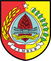
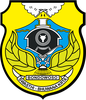
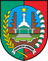
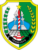
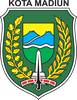

# KODE/LAMBANG KABUPATEN/KOTA DI PROVINSI JAWA TIMUR

| kode  |nama                          | filename  |logo/lambang                   |
|-------|------------------------------|-----------|:-----------------------------:|
| 35.01 |Kabupaten Pacitan             | 35.01.png ||
| 35.02 |Kabupaten Ponorogo            | 35.02.png ||
| 35.03 |Kabupaten Trenggalek          | 35.03.png ||
| 35.04 |Kabupaten Tulungagung         | 35.04.png ||
| 35.05 |Kabupaten Blitar              | 35.05.png ||
| 35.06 |Kabupaten Kediri              | 35.06.png ||
| 35.07 |Kabupaten Malang              | 35.07.png ||
| 35.08 |Kabupaten Lumajang            | 35.08.png ||
| 35.09 |Kabupaten Jember              | 35.09.png ||
| 35.10 |Kabupaten Banyuwangi          | 35.10.png ||
| 35.11 |Kabupaten Bondowoso           | 35.11.png ||
| 35.12 |Kabupaten Situbondo           | 35.12.png ||
| 35.13 |Kabupaten Probolinggo         | 35.13.png ||
| 35.14 |Kabupaten Pasuruan            | 35.14.png ||
| 35.15 |Kabupaten Sidoarjo            | 35.15.png ||
| 35.16 |Kabupaten Mojokerto           | 35.16.png ||
| 35.17 |Kabupaten Jombang             | 35.17.png ||
| 35.18 |Kabupaten Nganjuk             | 35.18.png ||
| 35.19 |Kabupaten Madiun              | 35.19.png ||
| 35.20 |Kabupaten Magetan             | 35.20.png ||
| 35.21 |Kabupaten Ngawi               | 35.21.png ||
| 35.22 |Kabupaten Bojonegoro          | 35.22.png ||
| 35.23 |Kabupaten Tuban               | 35.23.png ||
| 35.24 |Kabupaten Lamongan            | 35.24.png ||
| 35.25 |Kabupaten Gresik              | 35.25.png ||
| 35.26 |Kabupaten Bangkalan           | 35.26.png ||
| 35.27 |Kabupaten Sampang             | 35.27.png ||
| 35.28 |Kabupaten Pamekasan           | 35.28.png ||
| 35.29 |Kabupaten Sumenep             | 35.29.png ||
| 35.71 |Kota Kediri                   | 35.71.png ||
| 35.72 |Kota Blitar                   | 35.72.png ||
| 35.73 |Kota Malang                   | 35.73.png ||
| 35.74 |Kota Probolinggo              | 35.74.png ||
| 35.75 |Kota Pasuruan                 | 35.75.png ||
| 35.76 |Kota Mojokerto                | 35.76.png ||
| 35.77 |Kota Madiun                   | 35.77.png ||
| 35.78 |Kota Surabaya                 | 35.78.png ||
| 35.79 |Kota Batu                     | 35.79.png ||
