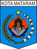

# KODE/LAMBANG KABUPATEN/KOTA DI PROVINSI NTB

| kode  |nama                          | filename  |logo/lambang                   |
|-------|------------------------------|-----------|:-----------------------------:|
| 52.01 |Kabupaten Lombok Barat        | 52.01.png ||
| 52.02 |Kabupaten Lombok Tengah       | 52.02.png ||
| 52.03 |Kabupaten Lombok Timur        | 52.03.png ||
| 52.04 |Kabupaten Sumbawa             | 52.04.png ||
| 52.05 |Kabupaten Dompu               | 52.05.png ||
| 52.06 |Kabupaten Bima                | 52.06.png ||
| 52.07 |Kabupaten Sumbawa Barat       | 52.07.png ||
| 52.08 |Kabupaten Lombok Utara        | 52.08.png ||
| 52.71 |Kota Mataram                  | 52.71.png ||
| 52.72 |Kota Bima                     | 52.72.png ||
