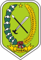
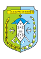
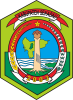
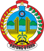
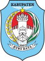

# KODE/LAMBANG KABUPATEN/KOTA DI PROVINSI KALIMANTAN BARAT

| kode  |nama                          | filename  |logo/lambang                   |
|-------|------------------------------|-----------|:-----------------------------:|
| 61.01 |Kabupaten Sambas              | 61.01.png ||
| 61.02 |Kabupaten Mempawah            | 61.02.png ||
| 61.03 |Kabupaten Sanggau             | 61.03.png ||
| 61.04 |Kabupaten Ketapang            | 61.04.png ||
| 61.05 |Kabupaten Sintang             | 61.05.png ||
| 61.06 |Kabupaten Kapuas Hulu         | 61.06.png ||
| 61.07 |Kabupaten Bengkayang          | 61.07.png ||
| 61.08 |Kabupaten Landak              | 61.08.png ||
| 61.09 |Kabupaten Sekadau             | 61.09.png ||
| 61.10 |Kabupaten Melawi              | 61.10.png ||
| 61.11 |Kabupaten Kayong Utara        | 61.11.png ||
| 61.12 |Kabupaten Kubu Raya           | 61.12.png ||
| 61.71 |Kota Pontianak                | 61.71.png ||
| 61.72 |Kota Singkawang               | 61.72.png ||
