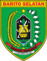
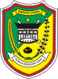
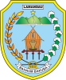
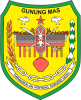

# KODE/LAMBANG KABUPATEN/KOTA DI PROVINSI KALIMANTAN TENGAH

| kode  |nama                          | filename  |logo/lambang                   |
|-------|------------------------------|-----------|:-----------------------------:|
| 62.01 |Kabupaten Kotawaringin Barat  | 62.01.png ||
| 62.02 |Kabupaten Kotawaringin Timur  | 62.02.png ||
| 62.03 |Kabupaten Kapuas              | 62.03.png ||
| 62.04 |Kabupaten Barito Selatan      | 62.04.png ||
| 62.05 |Kabupaten Barito Utara        | 62.05.png ||
| 62.06 |Kabupaten Katingan            | 62.06.png ||
| 62.07 |Kabupaten Seruyan             | 62.07.png ||
| 62.08 |Kabupaten Sukamara            | 62.08.png ||
| 62.09 |Kabupaten Lamandau            | 62.09.png ||
| 62.10 |Kabupaten Gunung Mas          | 62.10.png ||
| 62.11 |Kabupaten Pulang Pisau        | 62.11.png ||
| 62.12 |Kabupaten Murung Raya         | 62.12.png ||
| 62.13 |Kabupaten Barito Timur        | 62.13.png ||
| 62.71 |Kota Palangkaraya             | 62.71.png ||
