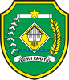
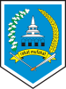
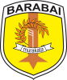
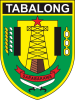

# KODE/LAMBANG KABUPATEN/KOTA DI PROVINSI KALIMANTAN SELATAN

| kode  |nama                          | filename  |logo/lambang                   |
|-------|------------------------------|-----------|:-----------------------------:|
| 63.01 |Kabupaten Tanah Laut          | 63.01.png ||
| 63.02 |Kabupaten Kotabaru            | 63.02.png ||
| 63.03 |Kabupaten Banjar              | 63.03.png ||
| 63.04 |Kabupaten Barito Kuala        | 63.04.png ||
| 63.05 |Kabupaten Tapin               | 63.05.png ||
| 63.06 |Kabupaten Hulu Sungai Selatan | 63.06.png ||
| 63.07 |Kabupaten Hulu Sungai Tengah  | 63.07.png ||
| 63.08 |Kabupaten Hulu Sungai Utara   | 63.08.png ||
| 63.09 |Kabupaten Tabalong            | 63.09.png ||
| 63.10 |Kabupaten Tanah Bumbu         | 63.10.png ||
| 63.11 |Kabupaten Balangan            | 63.11.png ||
| 63.71 |Kota Banjarmasin              | 63.71.png ||
| 63.72 |Kota Banjarbaru               | 63.72.png ||
