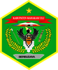
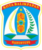
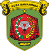

# KODE/LAMBANG KABUPATEN/KOTA DI PROVINSI KALIMANTAN TIMUR

| kode  |nama                          | filename  |logo/lambang                   |
|-------|------------------------------|-----------|:-----------------------------:|
| 64.01 |Kabupaten Paser               | 64.01.png ||
| 64.02 |Kabupaten Kutai Kartanegara   | 64.02.png ||
| 64.03 |Kabupaten Berau               | 64.03.png ||
| 64.07 |Kabupaten Kutai Barat         | 64.07.png ||
| 64.08 |Kabupaten Kutai Timur         | 64.08.png ||
| 64.09 |Kabupaten Penajam Paser Utara | 64.09.png ||
| 64.11 |Kabupaten Mahakam Ulu         | 64.11.png ||
| 64.71 |Kota Balikpapan               | 64.71.png ||
| 64.72 |Kota Samarinda                | 64.72.png ||
| 64.74 |Kota Bontang                  | 64.74.png ||
