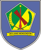
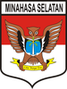
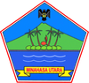
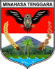
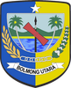
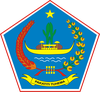
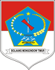
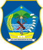
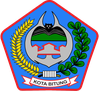
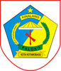

# KODE/LAMBANG KABUPATEN/KOTA DI PROVINSI SULAWESI UTARA

| kode  |nama                          | filename  |logo/lambang                   |
|-------|------------------------------|-----------|:-----------------------------:|
| 71.01 |Kabupaten Bolaang Mongondow   | 71.01.png ||
| 71.02 |Kabupaten Minahasa            | 71.02.png ||
| 71.03 |Kabupaten Kepulauan Sangihe   | 71.03.png ||
| 71.04 |Kabupaten Kepulauan Talaud    | 71.04.png ||
| 71.05 |Kabupaten Minahasa Selatan    | 71.05.png ||
| 71.06 |Kabupaten Minahasa Utara      | 71.06.png ||
| 71.07 |Kabupaten Minahasa Tenggara   | 71.07.png ||
| 71.08 |Kabupaten Bolaang Mongondow Utara| 71.08.png ||
| 71.09 |Kabupaten Kep. Siau Tagulandang Biaro| 71.09.png ||
| 71.10 |Kabupaten Bolaang Mongondow Timur| 71.10.png ||
| 71.11 |Kabupaten Bolaang Mongondow Selatan| 71.11.png ||
| 71.71 |Kota Manado                   | 71.71.png ||
| 71.72 |Kota Bitung                   | 71.72.png ||
| 71.73 |Kota Tomohon                  | 71.73.png ||
| 71.74 |Kota Kotamobagu               | 71.74.png ||
