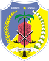

# KODE/LAMBANG KABUPATEN/KOTA DI PROVINSI SULAWESI TENGAH

| kode  |nama                          | filename  |logo/lambang                   |
|-------|------------------------------|-----------|:-----------------------------:|
| 72.01 |Kabupaten Banggai             | 72.01.png ||
| 72.02 |Kabupaten Poso                | 72.02.png ||
| 72.03 |Kabupaten Donggala            | 72.03.png ||
| 72.04 |Kabupaten Toli-Toli           | 72.04.png ||
| 72.05 |Kabupaten Buol                | 72.05.png ||
| 72.06 |Kabupaten Morowali            | 72.06.png ||
| 72.07 |Kabupaten Banggai Kepulauan   | 72.07.png ||
| 72.08 |Kabupaten Parigi Moutong      | 72.08.png ||
| 72.09 |Kabupaten Tojo Una Una        | 72.09.png ||
| 72.10 |Kabupaten Sigi                | 72.10.png ||
| 72.11 |Kabupaten Banggai Laut        | 72.11.png ||
| 72.12 |Kabupaten Morowali Utara      | 72.12.png ||
| 72.71 |Kota Palu                     | 72.71.png ||
