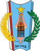
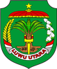
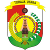

# KODE/LAMBANG KABUPATEN/KOTA DI PROVINSI SULAWESI SELATAN

| kode  |nama                          | filename  |logo/lambang                   |
|-------|------------------------------|-----------|:-----------------------------:|
| 73.01 |Kabupaten Kepulauan Selayar   | 73.01.png ||
| 73.02 |Kabupaten Bulukumba           | 73.02.png ||
| 73.03 |Kabupaten Bantaeng            | 73.03.png ||
| 73.04 |Kabupaten Jeneponto           | 73.04.png ||
| 73.05 |Kabupaten Takalar             | 73.05.png ||
| 73.06 |Kabupaten Gowa                | 73.06.png ||
| 73.07 |Kabupaten Sinjai              | 73.07.png ||
| 73.08 |Kabupaten Bone                | 73.08.png ||
| 73.09 |Kabupaten Maros               | 73.09.png ||
| 73.10 |Kabupaten Pangkajene dan Kepulauan| 73.10.png ||
| 73.11 |Kabupaten Barru               | 73.11.png ||
| 73.12 |Kabupaten Soppeng             | 73.12.png ||
| 73.13 |Kabupaten Wajo                | 73.13.png ||
| 73.14 |Kabupaten Sidenreng Rappang   | 73.14.png ||
| 73.15 |Kabupaten Pinrang             | 73.15.png ||
| 73.16 |Kabupaten Enrekang            | 73.16.png ||
| 73.17 |Kabupaten Luwu                | 73.17.png ||
| 73.18 |Kabupaten Tana Toraja         | 73.18.png ||
| 73.22 |Kabupaten Luwu Utara          | 73.22.png ||
| 73.24 |Kabupaten Luwu Timur          | 73.24.png ||
| 73.26 |Kabupaten Toraja Utara        | 73.26.png ||
| 73.71 |Kota Makassar                 | 73.71.png ||
| 73.72 |Kota Parepare                 | 73.72.png ||
| 73.73 |Kota Palopo                   | 73.73.png ||
