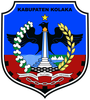
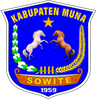
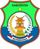
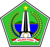
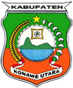
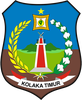
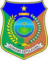
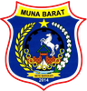
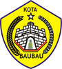

# KODE/LAMBANG KABUPATEN/KOTA DI PROVINSI SULAWESI TENGGARA

| kode  |nama                          | filename  |logo/lambang                   |
|-------|------------------------------|-----------|:-----------------------------:|
| 74.01 |Kabupaten Kolaka              | 74.01.png ||
| 74.02 |Kabupaten Konawe              | 74.02.png ||
| 74.03 |Kabupaten Muna                | 74.03.png ||
| 74.04 |Kabupaten Buton               | 74.04.png ||
| 74.05 |Kabupaten Konawe Selatan      | 74.05.png ||
| 74.06 |Kabupaten Bombana             | 74.06.png ||
| 74.07 |Kabupaten Wakatobi            | 74.07.png ||
| 74.08 |Kabupaten Kolaka Utara        | 74.08.png ||
| 74.09 |Kabupaten Konawe Utara        | 74.09.png ||
| 74.10 |Kabupaten Buton Utara         | 74.10.png ||
| 74.11 |Kabupaten Kolaka Timur        | 74.11.png ||
| 74.12 |Kabupaten Konawe Kepulauan    | 74.12.png ||
| 74.13 |Kabupaten Muna Barat          | 74.13.png ||
| 74.14 |Kabupaten Buton Tengah        | 74.14.png ||
| 74.15 |Kabupaten Buton Selatan       | 74.15.png ||
| 74.71 |Kota Kendari                  | 74.71.png ||
| 74.72 |Kota Bau Bau                  | 74.72.png ||
