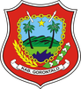
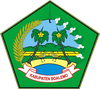
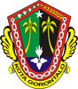

# KODE/LAMBANG KABUPATEN/KOTA DI PROVINSI GORONTALO

| kode  |nama                          | filename  |logo/lambang                   |
|-------|------------------------------|-----------|:-----------------------------:|
| 75.01 |Kabupaten Gorontalo           | 75.01.png ||
| 75.02 |Kabupaten Boalemo             | 75.02.png ||
| 75.03 |Kabupaten Bone Bolango        | 75.03.png ||
| 75.04 |Kabupaten Pohuwato            | 75.04.png ||
| 75.05 |Kabupaten Gorontalo Utara     | 75.05.png ||
| 75.71 |Kota Gorontalo                | 75.71.png ||
