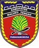
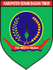
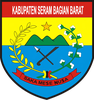
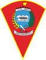

# KODE/LAMBANG KABUPATEN/KOTA DI PROVINSI MALUKU

| kode  |nama                          | filename  |logo/lambang                   |
|-------|------------------------------|-----------|:-----------------------------:|
| 81.01 |Kabupaten Maluku Tengah       | 81.01.png ||
| 81.02 |Kabupaten Maluku Tenggara     | 81.02.png ||
| 81.03 |Kabupaten Kepulauan Tanimbar  | 81.03.png ||
| 81.04 |Kabupaten Buru                | 81.04.png ||
| 81.05 |Kabupaten Seram Bagian Timur  | 81.05.png ||
| 81.06 |Kabupaten Seram Bagian Barat  | 81.06.png ||
| 81.07 |Kabupaten Kepulauan Aru       | 81.07.png ||
| 81.08 |Kabupaten Maluku Barat Daya   | 81.08.png ||
| 81.09 |Kabupaten Buru Selatan        | 81.09.png ||
| 81.71 |Kota Ambon                    | 81.71.png ||
| 81.72 |Kota Tual                     | 81.72.png ||
