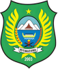
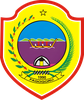
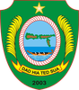
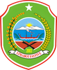
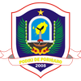
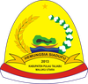
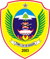

# KODE/LAMBANG KABUPATEN/KOTA DI PROVINSI MALUKU UTARA

| kode  |nama                          | filename  |logo/lambang                   |
|-------|------------------------------|-----------|:-----------------------------:|
| 82.01 |Kabupaten Halmahera Barat     | 82.01.png ||
| 82.02 |Kabupaten Halmahera Tengah    | 82.02.png ||
| 82.03 |Kabupaten Halmahera Utara     | 82.03.png ||
| 82.04 |Kabupaten Halmahera Selatan   | 82.04.png ||
| 82.05 |Kabupaten Kepulauan Sula      | 82.05.png ||
| 82.06 |Kabupaten Halmahera Timur     | 82.06.png ||
| 82.07 |Kabupaten Pulau Morotai       | 82.07.png ||
| 82.08 |Kabupaten Pulau Taliabu       | 82.08.png ||
| 82.71 |Kota Ternate                  | 82.71.png ||
| 82.72 |Kota Tidore Kepulauan         | 82.72.png ||
