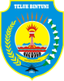

# KODE/LAMBANG KABUPATEN/KOTA DI PROVINSI PAPUA BARAT

| kode  |nama                          | filename  |logo/lambang                   |
|-------|------------------------------|-----------|:-----------------------------:|
| 92.02 |Kabupaten Manokwari           | 92.02.png ||
| 92.03 |Kabupaten Fak Fak             | 92.03.png ||
| 92.06 |Kabupaten Teluk Bintuni       | 92.06.png ||
| 92.07 |Kabupaten Teluk Wondama       | 92.07.png ||
| 92.08 |Kabupaten Kaimana             | 92.08.png ||
| 92.11 |Kabupaten Manokwari Selatan   | 92.11.png ||
| 92.12 |Kabupaten Pegunungan Arfak    | 92.12.png ||
