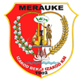
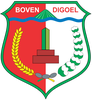

# KODE/LAMBANG KABUPATEN/KOTA DI PROVINSI PAPUA SELATAN

| kode  |nama                          | filename  |logo/lambang                   |
|-------|------------------------------|-----------|:-----------------------------:|
| 93.01 |Kabupaten Merauke             | 93.01.png ||
| 93.02 |Kabupaten Boven Digoel        | 93.02.png ||
| 93.03 |Kabupaten Mappi               | 93.03.png ||
| 93.04 |Kabupaten Asmat               | 93.04.png ||
                                                    