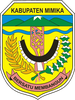
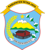

# KODE/LAMBANG KABUPATEN/KOTA DI PROVINSI PAPUA TENGAH

| kode  |nama                          | filename  |logo/lambang                   |
|-------|------------------------------|-----------|:-----------------------------:|
| 94.01 |Kabupaten Nabire              | 94.01.png ||
| 94.02 |Kabupaten Puncak Jaya         | 94.02.png ||
| 94.03 |Kabupaten Paniai              | 94.03.png ||
| 94.04 |Kabupaten Mimika              | 94.04.png ||
| 94.05 |Kabupaten Puncak              | 94.05.png ||
| 94.06 |Kabupaten Dogiyai             | 94.06.png ||
| 94.07 |Kabupaten Intan Jaya          | 94.07.png ||
| 94.08 |Kabupaten Deiyai              | 94.08.png ||
