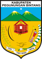

# KODE/LAMBANG KABUPATEN/KOTA DI PROVINSI PAPUA PEGUNUNGAN

| kode  |nama                          | filename  |logo/lambang                   |
|-------|------------------------------|-----------|:-----------------------------:|
| 95.01 |Kabupaten Jayawijaya          | 95.01.png ||
| 95.02 |Kabupaten Pegunungan Bintang  | 95.02.png ||
| 95.03 |Kabupaten Yahukimo            | 95.03.png ||
| 95.04 |Kabupaten Tolikara            | 95.04.png ||
| 95.05 |Kabupaten Mamberamo Tengah    | 95.05.png ||
| 95.06 |Kabupaten Yalimo              | 95.06.png ||
| 95.07 |Kabupaten Lanny Jaya          | 95.07.png ||
| 95.08 |Kabupaten Nduga               | 95.08.png ||
