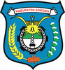
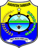
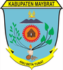
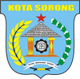

# KODE/LAMBANG KABUPATEN/KOTA DI PROVINSI PAPUA BARAT DAYA

| kode  |nama                          | filename  |logo/lambang                   |
|-------|------------------------------|-----------|:-----------------------------:|
| 96.01 |Kabupaten Sorong              | 96.01.png ||
| 96.02 |Kabupaten Sorong Selatan      | 96.02.png ||
| 96.03 |Kabupaten Raja Ampat          | 96.03.png ||
| 96.04 |Kabupaten Tambrauw            | 96.04.png ||
| 96.05 |Kabupaten Maybrat             | 96.05.png ||
| 96.71 |Kota Sorong                   | 96.71.png ||
                                                   