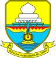
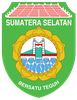
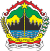
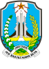
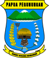

# DATA KODE/LAMBANG PROVINSI

|kode|nama provinsi                 |filename|logo/lambang                   |
|----|------------------------------|--------|:-----------------------------:|
| 11 |Aceh                          | 11.png ||
| 12 |Sumatera Utara                | 12.png ||
| 13 |Sumatera Barat                | 13.png ||
| 14 |Riau                          | 14.png ||
| 15 |Jambi                         | 15.png ||
| 16 |Sumatera Selatan              | 16.png ||
| 17 |Bengkulu                      | 17.png ||
| 18 |Lampung                       | 18.png ||
| 19 |Kepulauan Bangka Belitung     | 19.png ||
| 21 |Kepulauan Riau                | 21.png ||
| 31 |Daerah Khusus Ibukota Jakarta | 31.png ||
| 32 |Jawa Barat                    | 32.png ||
| 33 |Jawa Tengah                   | 33.png ||
| 34 |Daerah Istimewa Yogyakarta    | 34.png ||
| 35 |Jawa Timur                    | 35.png ||
| 36 |Banten                        | 36.png ||
| 51 |Bali                          | 51.png ||
| 52 |Nusa Tenggara Barat           | 52.png ||
| 53 |Nusa Tenggara Timur           | 53.png ||
| 61 |Kalimantan Barat              | 61.png ||
| 62 |Kalimantan Tengah             | 62.png ||
| 63 |Kalimantan Selatan            | 63.png ||
| 64 |Kalimantan Timur              | 64.png ||
| 65 |Kalimantan Utara              | 65.png ||
| 71 |Sulawesi Utara                | 71.png ||
| 72 |Sulawesi Tengah               | 72.png ||
| 73 |Sulawesi Selatan              | 73.png ||
| 74 |Sulawesi Tenggara             | 74.png ||
| 75 |Gorontalo                     | 75.png ||
| 76 |Sulawesi Barat                | 76.png ||
| 81 |Maluku                        | 81.png ||
| 82 |Maluku Utara                  | 82.png ||
| 91 |Papua                         | 91.png ||
| 92 |Papua Barat                   | 92.png ||
| 93 |Papua Selatan                 | 93.png ||
| 94 |Papua Tengah                  | 94.png ||
| 95 |Papua Pegunungan              | 95.png ||
| 96 |Papua Barat Daya              | 96.png ||
